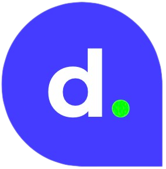

# Aplicativo de rastreamento de entregas


## Iniciar o Monorepo (one cmd):

```shell
yarn env

yarn start
```

- Tome uma agua ;)

- Depois que os containers estiverem no ar, acesse: http://localhost:8080/

## Rodar todos os tests principais:

```shell
yarn test
```

## Instalar todas as dependencias (caso queira rodar sem o docker):

```shell
yarn install:all
```

## Sobre

### Pastas:

- [backend](/backend/)
- [frontend](/frontend/)

### Principios:
- Executar o aplicativo com um comando usando docker `yarn start`
- SOLID
- Testes unitários

### Linguagem:
- TypeScript / JavaScript
- SQL

### Front:
- React com Redux
- Atomic Desing

### Back:
- NestJS com Prisma
- API RESTful
- banco de dados PostgreSQL


### Tecnologias:
- Docker
- Node
- NestJS
- Prisma
- PostgreSQL
- TypeScript
- React
- Redux
