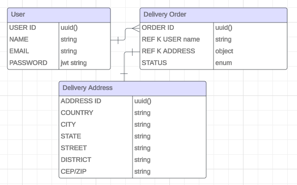

yarn prisma migrate dev

Iniciar app:

docker-compose up -d

docker exec -it enock-delliv-challenge-backend-1 yarn prisma migrate dev

no authenticated:
- [x] Register user: http://localhost:4242/auth/register
- [x] Login user: http://localhost:4242/auth/login

authenticated:
- [x] list all users: http://localhost:4242/users

- [ ] list profile: http://localhost:4242/profile

delivery order:
- [x] Create Delivery Order: http://localhost:4242/delivery/create

- [x] List All Delivery Order by User: http://localhost:4242/delivery

- [x] Delete Delivery Order: http://localhost:4242/delivery/delete/:id

Requisitos Challenge:

- [x] Crie um controlador em NestJS para manipular as requisições relacionadas aos pedidos.
  - [x] Create Delivery Order by User: http://localhost:4242/delivery/:userId

- [x] Implemente os endpoints para obter a lista de pedidos e atualizar o status de um pedido.
  - [x] List All Delivery Order by User: http://localhost:4242/delivery
  - [x] List One Delivery Order by User: http://localhost:4242/delivery/:id
  - [x] Update One Delivery Order by User: http://localhost:4242/delivery/:id
  - [x] Delete One Delivery Order by User: http://localhost:4242/delivery/:id

- [x] Implemente as rotas para autenticação de usuário, incluindo login.
  no authenticated:
    - [x] Register user: http://localhost:4242/auth/register
    - [x] Login user: http://localhost:4242/auth/login

- [x] Use o Prisma para realizar as operações de leitura e escrita no banco de dados.

- [x] Implemente a funcionalidade de autenticação de usuário, gerando tokens de acesso seguro.

- [x] Desenvolva os middlewares necessários para autorização de rotas protegidas.